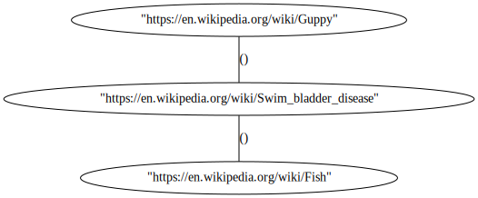

# jrawler-graph
 Graph Visualiser - Website Crawler


### Examples
```console
cargo run -- --start https://en.wikipedia.org/wiki/Guppy --target https://en.wikipedia.org/wiki/Sauce --max-pages 1000 -i \.svg,Special:,Wikipedia:,Help:,Talk:,File:Template:,Portal:,\.gif,\.jpg,\.png

--- Shortest Path to Target ---
Cost: 2
  - https://en.wikipedia.org/wiki/Guppy
  - https://en.wikipedia.org/wiki/Swim_bladder_disease
  - https://en.wikipedia.org/wiki/Fish
-------------------------------
```

Image Produced:

